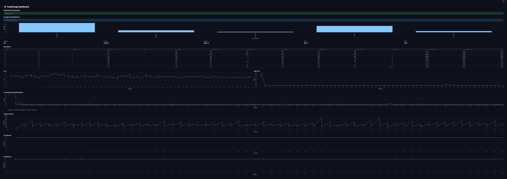
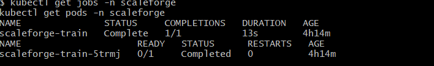
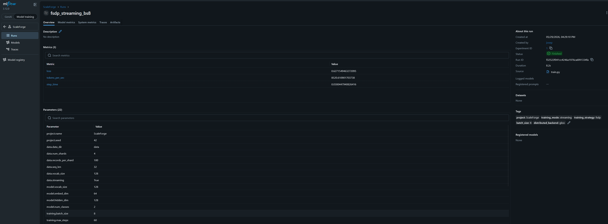
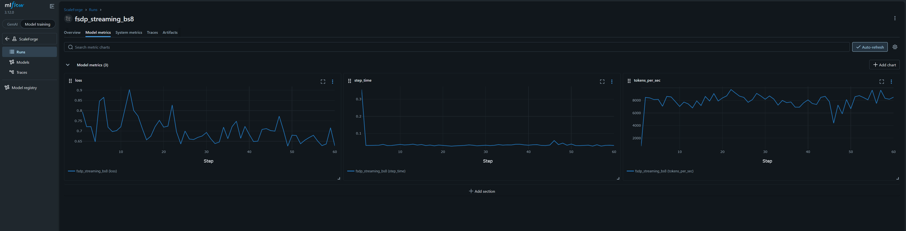

<div align="center">

# 🚀 ScaleForge

### Production-Grade Distributed Training Infrastructure for Large-Scale AI Models

<p>
  
  
  
  
</p>

<p>
  
  
  
  
</p>

<b>
Streaming Data → DDP → FSDP → ZeRO → DeepSpeed → MLflow → Kubernetes → Observability
</b>

</div>

---

# 📌 Project Overview

ScaleForge is a portfolio-grade ML Systems and Distributed Training platform designed to demonstrate how modern AI training infrastructure is built.

The project includes:

- Distributed training with DDP
- Fully Sharded Data Parallel (FSDP)
- PyTorch ZeRO optimizer sharding
- DeepSpeed ZeRO-2 integration
- Streaming sharded datasets
- Fault-tolerant checkpointing
- MLflow experiment tracking
- Streamlit observability dashboards
- Bottleneck detection
- Straggler detection
- Docker deployment
- Kubernetes job orchestration

---

# 🏗️ Architecture

```text
YAML Config
    ↓
Experiment Runner
    ↓
Trainer
    ↓
Streaming Dataset + Tiny Transformer
    ↓
DDP / FSDP / ZeRO / DeepSpeed
    ↓
Metrics + Checkpoints
    ↓
MLflow + Streamlit
    ↓
Kubernetes Jobs
```

See: docs/architecture.md

---

# ✨ Features

## Training

- Single-process training
- Distributed Data Parallel (DDP)
- Fully Sharded Data Parallel (FSDP)
- PyTorch ZeroRedundancyOptimizer
- DeepSpeed ZeRO-2 engine
- CUDA-aware device management

## Data

- Synthetic sharded dataset generation
- Streaming dataset loader
- Distributed shard assignment

## Reliability

- Checkpoint save/load
- Resume training
- Fault injection
- FSDP checkpoint support
- ZeRO checkpoint support

## Observability

- Loss tracking
- Tokens/sec throughput
- CPU memory tracking
- GPU memory tracking
- Timing breakdown analysis
- Bottleneck detection
- Straggler detection

## Experiment Tracking

- MLflow
- SQLite backend
- Named runs
- Experiment comparison
- Automated experiment runner

## Platform

- Docker
- Kubernetes namespace
- Persistent Volume Claims
- Kubernetes Jobs
- Run / Logs / Status scripts

---

# 📸 Screenshots

## Dashboard



## Kubernetes Training Job



## MLflow Overview



## MLflow Metrics



---

# 📂 Project Structure

```text
scaleforge/
├── configs/
├── configs/experiments/
├── configs/deepspeed/
├── src/scaleforge/
├── tests/
├── metrics/
├── checkpoints/
├── k8s/
├── scripts/
├── docs/
├── dashboard.py
├── train.py
├── local_ddp.py
├── Dockerfile
├── Dockerfile.deepspeed
└── README.md
```

---

# ⚙️ Setup

## Create Environment

```bash
python -m venv .venv
source .venv/Scripts/activate
```

## Install

```bash
pip install -r requirements.txt
pip install -e .
```

## Generate Data

```bash
python src/scaleforge/generate_data.py --config configs/config.yaml
```

---

# ▶️ Training

## Single Process

```bash
python train.py
```

## DDP

```bash
python local_ddp.py
```

## FSDP

```bash
python local_ddp.py --config configs/experiments/fsdp.yaml
```

## PyTorch ZeRO

```bash
python local_ddp.py --config configs/experiments/zero.yaml
```

## DeepSpeed ZeRO-2

```bash
docker build -f Dockerfile.deepspeed -t scaleforge-deepspeed:latest .
docker run --rm --gpus all scaleforge-deepspeed:latest
```

---

# 📊 Dashboard

Launch:

```bash
streamlit run dashboard.py
```

Tracks:

- Loss
- Step Time
- Tokens/sec
- CPU Memory
- GPU Memory
- Timing Breakdown
- Bottleneck Analysis
- Distributed Training Health

---

# 📈 MLflow

Launch:

```bash
mlflow ui --backend-store-uri sqlite:///mlflow.db
```

Capabilities:

- Run comparison
- Hyperparameter tracking
- Metric tracking
- Strategy comparison (DDP/FSDP/ZeRO/DeepSpeed)

---

# ☸️ Kubernetes

Deploy:

```bash
kubectl apply -f k8s/namespace.yaml
kubectl apply -f k8s/pvc.yaml
kubectl apply -f k8s/training-job.yaml
```

Helper scripts:

```bash
bash k8s/run_job.sh
bash k8s/logs.sh
bash k8s/status.sh
```

---

# 🧪 Testing

```bash
pytest -v
```

Current Status:

```text
13 passed
0 failed
```

Coverage includes:

- Config loading
- Dataset loading
- Streaming datasets
- Model forward pass
- Checkpointing
- Metrics logging
- Strategy selection
- Bottleneck detection
- Straggler detection
- MLflow naming

---

# 🛠 Major Build Milestones

1. Config-driven training system
2. Sharded data generation
3. Streaming dataset pipeline
4. Tiny Transformer model
5. DDP training
6. FSDP training
7. PyTorch ZeRO optimizer sharding
8. DeepSpeed ZeRO-2 engine
9. Checkpointing and resume
10. Fault injection
11. MLflow integration
12. Streamlit observability dashboard
13. Straggler detection
14. Kubernetes deployment
15. Automated experiment runner

---

# 📌 Portfolio Highlights

This project demonstrates:

- Distributed AI Training Infrastructure
- ML Systems Engineering
- Model Sharding
- Optimizer Sharding
- Experiment Tracking
- Kubernetes Orchestration
- Production Observability
- Performance Engineering

---

### 🛠️ Major Build Steps

#### Step 1: Define Project Scope and MVP

- Step 1A: Define ScaleForge as a distributed AI training infrastructure platform
- Step 1B: Define support for local CPU/GPU training
- Step 1C: Define distributed training goals for DDP, FSDP, ZeRO, and DeepSpeed
- Step 1D: Define observability goals for throughput, memory, timing, bottlenecks, and stragglers

#### Step 2: Create GitHub-Ready Folder Structure

- Step 2A: Create root project folder
- Step 2B: Create `src/scaleforge/` package
- Step 2C: Create `configs/`, `tests/`, `metrics/`, and `checkpoints/`
- Step 2D: Add `pyproject.toml`, `requirements.txt`, and package initialization files

#### Step 3: Add Configuration System

- Step 3A: Add YAML-driven project configuration
- Step 3B: Add training, data, model, distributed, FSDP, ZeRO, and DeepSpeed sections
- Step 3C: Add `load_config()` utility
- Step 3D: Validate config loading with unit tests

#### Step 4: Build Synthetic Sharded Dataset Generator

- Step 4A: Generate JSONL dataset shards
- Step 4B: Add configurable number of shards
- Step 4C: Add configurable sequence length and vocabulary size
- Step 4D: Add deterministic seed-driven dataset generation

#### Step 5: Add Dataset Loading Layer

- Step 5A: Add in-memory sharded dataset loader
- Step 5B: Add streaming sharded dataset loader
- Step 5C: Add distributed rank-aware shard assignment
- Step 5D: Add dataset unit tests

#### Step 6: Build Tiny Transformer Model

- Step 6A: Add embedding layer
- Step 6B: Add Transformer encoder blocks
- Step 6C: Add classification head
- Step 6D: Add model forward-pass unit test

#### Step 7: Add Single-Process Training Loop

- Step 7A: Add DataLoader integration
- Step 7B: Add optimizer and loss function
- Step 7C: Add training loop with max-step control
- Step 7D: Add CSV metrics logging

#### Step 8: Add Checkpointing and Resume

- Step 8A: Add checkpoint manager
- Step 8B: Save model state, optimizer state, and training step
- Step 8C: Add `latest.pt` checkpoint support
- Step 8D: Add checkpoint save/load tests

#### Step 9: Add Fault Injection

- Step 9A: Add configurable `fail_after_steps`
- Step 9B: Simulate training failure
- Step 9C: Resume from latest checkpoint
- Step 9D: Demonstrate fault-tolerant recovery

#### Step 10: Add Distributed Data Parallel (DDP)

- Step 10A: Add distributed process group utilities
- Step 10B: Add `DistributedSampler`
- Step 10C: Wrap model with PyTorch DDP
- Step 10D: Add Windows-safe `local_ddp.py` launcher

#### Step 11: Add Throughput and System Profiling

- Step 11A: Track step time
- Step 11B: Track tokens/sec
- Step 11C: Track CPU memory
- Step 11D: Track GPU memory

#### Step 12: Add Data Pipeline Timing Breakdown

- Step 12A: Track data loading time
- Step 12B: Track forward pass time
- Step 12C: Track backward pass time
- Step 12D: Track optimizer and checkpoint time

#### Step 13: Add Streamlit Observability Dashboard

- Step 13A: Add KPI cards
- Step 13B: Add loss and throughput charts
- Step 13C: Add timing breakdown charts with units
- Step 13D: Add CPU/GPU memory charts

#### Step 14: Add Bottleneck Detection

- Step 14A: Analyze average timing components
- Step 14B: Identify the largest runtime component
- Step 14C: Display bottleneck chart in dashboard
- Step 14D: Add bottleneck unit test

#### Step 15: Add Rank-Level Metrics

- Step 15A: Write per-rank metrics files
- Step 15B: Separate DDP, FSDP, and ZeRO rank metrics
- Step 15C: Track rank-level step time
- Step 15D: Track rank-level tokens/sec

#### Step 16: Add Straggler Detection

- Step 16A: Compare average step time by rank
- Step 16B: Detect slow ranks using thresholding
- Step 16C: Add distributed health dashboard section
- Step 16D: Add straggler detection test

#### Step 17: Add MLflow Experiment Tracking

- Step 17A: Add MLflow SQLite backend
- Step 17B: Log config parameters
- Step 17C: Log loss, step time, and tokens/sec
- Step 17D: Add named runs for experiment comparison

#### Step 18: Add Automated Experiment Runner

- Step 18A: Add `scripts/run_experiments.py`
- Step 18B: Run all experiment YAML files automatically
- Step 18C: Compare batch size experiments
- Step 18D: Track runs in MLflow

#### Step 19: Add Kubernetes Deployment

- Step 19A: Add Kubernetes namespace manifest
- Step 19B: Add PersistentVolumeClaim
- Step 19C: Add training Job manifest
- Step 19D: Add `run_job.sh`, `logs.sh`, and `status.sh`

#### Step 20: Add Docker Support

- Step 20A: Add base Dockerfile
- Step 20B: Build local training image
- Step 20C: Load image into Minikube
- Step 20D: Run ScaleForge as a Kubernetes training job

#### Step 21: Add Fully Sharded Data Parallel (FSDP)

- Step 21A: Add FSDP config toggle
- Step 21B: Add CUDA local-rank device handling
- Step 21C: Wrap model with FSDP
- Step 21D: Add FSDP full-state checkpoint support

#### Step 22: Add PyTorch ZeRO Optimizer Sharding

- Step 22A: Add ZeRO config toggle
- Step 22B: Add ZeroRedundancyOptimizer
- Step 22C: Add ZeRO training strategy detection
- Step 22D: Add ZeRO model checkpoint support

#### Step 23: Add DeepSpeed ZeRO-2 Docker Backend

- Step 23A: Add DeepSpeed ZeRO-2 JSON config
- Step 23B: Add DeepSpeed experiment YAML
- Step 23C: Add CUDA development Docker image
- Step 23D: Validate DeepSpeed launcher inside Docker

#### Step 24: Add Full DeepSpeed Engine

- Step 24A: Add `DeepSpeedTrainer`
- Step 24B: Initialize model with `deepspeed.initialize()`
- Step 24C: Use DeepSpeed backward and optimizer step
- Step 24D: Validate `training_strategy=deepspeed_zero`

#### Step 25: Add Test Suite and CI

- Step 25A: Add config, data, model, checkpoint, metrics, strategy, bottleneck, straggler, and MLflow tests
- Step 25B: Reach 13 passing tests
- Step 25C: Add GitHub Actions workflow
- Step 25D: Validate project with `pytest -v`

#### Step 26: Add Portfolio Documentation

- Step 26A: Add architecture documentation
- Step 26B: Add dashboard screenshot
- Step 26C: Add Kubernetes screenshot
- Step 26D: Add MLflow screenshots


---

# 🔮 Future Improvements

- Multi-GPU DeepSpeed
- NCCL cluster training
- Distributed checkpointing
- Ray integration
- Cloud GPU deployment
- Model registry integration

---

# 📄 License

MIT License
